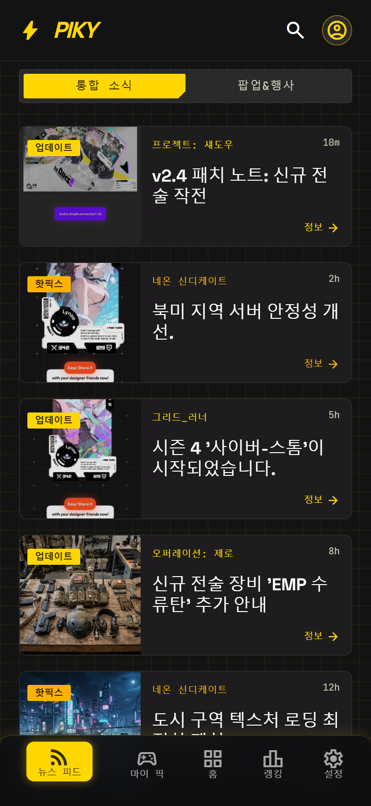
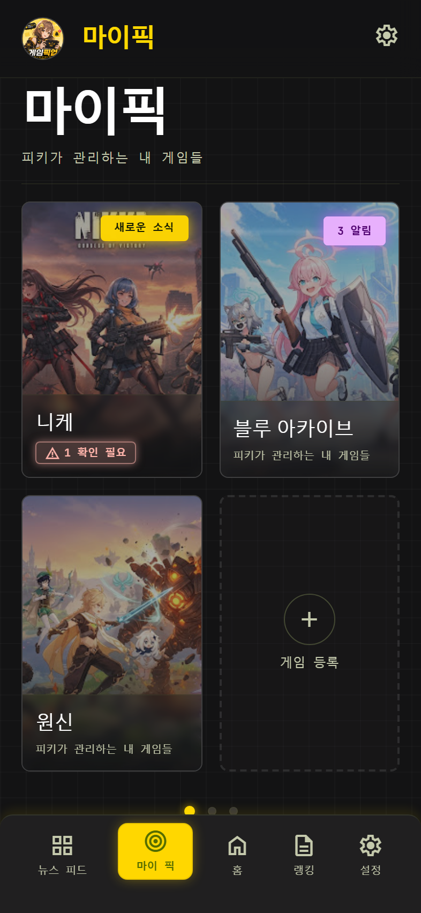
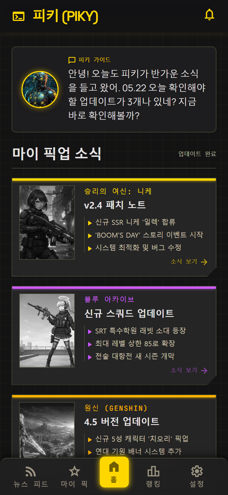
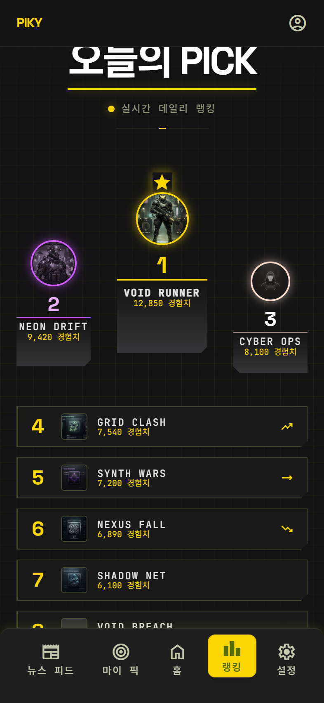
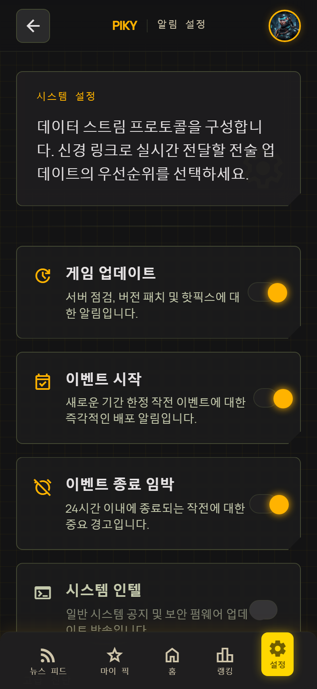

# GamePickup (PIKY)

관심 게임 소식을 한곳에서 보는 Android 우선 모바일 앱입니다.  
운영자가 검수·발행한 콘텐츠만 앱에 노출되고, RSS·자동화 수집은 초안(draft)까지만 들어옵니다.

| 구분 | 역할 |
|------|------|
| 모바일 앱 | 5탭 UI, 마이 픽·알림 설정, 문의 |
| API (`server/`) | 공개 조회 / 관리자 CRUD / Ingest 초안 수집 |
| 관리자 웹 (`admin/`) | 게임·소식 등록, 검수, 발행, 문의 확인 |

---

## 화면 구성 (5탭)

UI는 Stitch **Neon-Tactical** 시안을 기준으로 구현했습니다.  
아래 캡처는 `design-ref/` HTML 시안을 모바일 뷰포트(393×852)로 렌더링한 것입니다.

| 새 소식 | 마이 픽 | 홈 |
|:---:|:---:|:---:|
|  |  |  |
| 통합 소식·팝업&행사 세그먼트 | 2×2 슬롯 + 게임 등록 | 피키 가이드 + 마이 픽업 소식 |

| 랭킹 | 설정 |
|:---:|:---:|
|  |  |
| 포디움 + 관심 순위 | 알림 3종·공지·문의 |

**탭 순서:** 새 소식 · 마이 픽 · 홈 · 랭킹 · 설정

---

## 왜 이렇게 만들었는지

게임 소식은 공식 채널·커뮤니티·이벤트 페이지에 흩어져 있습니다.  
사용자 입장에서는 "내가 하는 게임 새 소식만 빠르게 보고 싶다"는 니즈가 있고, 운영 입장에서는 **검수 없이 올라가면 안 되는** 콘텐츠가 섞입니다.

그래서 흐름을 이렇게 잡았습니다.

```text
수집(Ingest) → draft → 운영 검수(reviewed) → 발행(published) → 앱 노출
```

앱 사용자는 로그인하지 않습니다. 대신 **설치 단위 credential**으로 기기·알림 설정만 서버와 맞춥니다.  
쓰기 권한은 관리자 JWT와 Ingest Key로 나눠서, 키가 유출돼도 피해 범위를 줄였습니다.

---

## 기술 스택

| 영역 | 스택 |
|------|------|
| 모바일 | Expo 57, React Native, TypeScript, Expo Router |
| API | Python, FastAPI, SQLAlchemy, Pydantic, pytest |
| 관리자 | Vite, React, TypeScript |
| 저장 | SQLite(개발) → PostgreSQL(운영 전환 예정) |
| 인증 | Admin JWT(bcrypt), Ingest API Key, Installation secret |

---

## 아키텍처 요약

### 모바일

화면은 공통 컴포넌트(`AppHeader`, `FeedCard`, `CustomTabBar` 등)로만 조립합니다.  
데이터는 `CatalogRepository` 뒤에 숨겨서 `preview` / `empty` / `api` 모드를 바꿔도 UI 코드는 그대로 둡니다.

```text
app/ → hooks/ → data/CatalogRepository → domain/
         ↘ state/ (온보딩·마이픽·알림 3종)
```

- 비민감 설정: AsyncStorage  
- 설치 secret: SecureStore  
- 반응형: `resolveLayout()` — 360 / 393 / 412dp 기준

### 백엔드

모듈형 모놀리스. 의존성은 안쪽으로만 갑니다.

```text
api/ → services/ → domain/ → repositories/
```

콘텐츠 상태는 Domain에서 강제합니다.

```text
draft → reviewed → published
```

발행 시 푸시는 outbox에만 적재하고, FCM 발송은 별도 dispatch로 분리했습니다. (발행 트랜잭션과 외부 API 장애 분리)

자세한 설명: [docs/BACKEND_ARCHITECTURE.md](docs/BACKEND_ARCHITECTURE.md)

---

## 프로젝트 구조

```text
.
├── app/                 # Expo Router (5탭 + 온보딩·문의)
├── src/                 # 컴포넌트, hooks, data, theme
├── server/              # FastAPI
├── admin/               # 관리자 웹
├── design-ref/          # Stitch 시안 HTML·DESIGN.md
├── docs/                # 아키텍처·결정 로그·스크린샷
└── tools/               # 스크린샷 캡처 스크립트
```

---

## 실행 방법

### 1. 모바일 (기본: preview 모드)

```powershell
cd C:\Users\user\Projects\pickup
npm install
npm run verify
npm run android
```

### Android Studio Live UI (권장)

개발 클라이언트를 한 번 설치한 뒤에는 매번 APK를 다시 빌드하지 않아도 됩니다. Android Studio에서 에뮬레이터를 켜고, 프로젝트 루트에서 Metro를 실행합니다.

```powershell
cd C:\Users\user\Projects\pickup
$env:NODE_OPTIONS = "--dns-result-order=ipv4first"
npx expo start --dev-client --host localhost --port 8081 --android --clear
```

이후 `app/` 또는 `src/`의 TypeScript·스타일을 저장하면 Fast Refresh로 에뮬레이터에 바로 반영됩니다. Metro 터미널에서 `r`을 누르면 수동 새로고침합니다.

다음 변경은 네이티브 APK를 다시 빌드해야 합니다.

- `android/`, `app.json`, 권한·아이콘·스플래시 변경
- 네이티브 모듈이 포함된 패키지 추가·삭제

API 연동 시:

```env
EXPO_PUBLIC_CATALOG_MODE=api
EXPO_PUBLIC_API_URL=http://<PC_IP>:8000
```

### 2. API

```powershell
cd server
python -m venv .venv
.\.venv\Scripts\pip install -r requirements.txt
# .env.example → .env (ADMIN_PASSWORD_HASH, JWT_SECRET, INGEST_API_KEY)
.\.venv\Scripts\pytest -q
.\.venv\Scripts\uvicorn app.main:app --reload --port 8000
```

### 3. 관리자 웹

```powershell
cd admin
npm install
npm run dev
```

### 스크린샷 다시 뽑기

```powershell
node tools/capture-screenshots.mjs
```

`design-ref/` HTML을 기준으로 `docs/screenshots/`에 5탭 이미지를 생성합니다.

---

## 주요 API

| Method | Path | 설명 |
|--------|------|------|
| GET | `/api/v1/games`, `/contents`, `/rankings` | 발행 콘텐츠 조회 (Public) |
| POST | `/api/v1/inquiries` | 문의 등록 |
| POST | `/api/v1/installations` | 설치 credential 발급 |
| POST | `/api/v1/admin/login` | 관리자 JWT |
| POST | `/api/v1/ingest/contents` | 초안 수집 (Ingest Key) |

---

## 문서

- [docs/ARCHITECTURE.md](docs/ARCHITECTURE.md) — 앱 계층·확장 지점
- [docs/BACKEND_ARCHITECTURE.md](docs/BACKEND_ARCHITECTURE.md) — API·상태머신·보안
- [docs/DECISIONS.md](docs/DECISIONS.md) — ADR (설계 결정 기록)
- [docs/PROGRESS.md](docs/PROGRESS.md) — 진행 현황

---

## 현재 상태

- [x] 5탭 UI + Preview/Empty/Api 카탈로그 모드
- [x] FastAPI 계층·상태머신·Admin/Ingest/Public 분리
- [x] 관리자 웹 CRUD·발행·문의
- [x] Installation 인증 + 푸시 outbox (FCM은 스텁)
- [ ] PostgreSQL·HTTPS 배포
- [ ] Play 스토어 출시

---

## 라이선스

개인 포트폴리오·실서비스 PoC 목적 프로젝트입니다.
